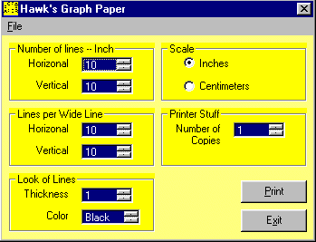



## Graph Paper

### Description

Create your own graph paper.

This is simple code that shows you how to work and draw to the printer. Also how scaling works with the printer object.
 
### More Info
 

             |
---                |---
**Submitted On**   |2000-04-05 08:12:58
**By**             |[Harold Hawk](https://github.com/Planet-Source-Code/PSCIndex/blob/master/ByAuthor/harold-hawk.md)
**Level**          |Beginner
**User Rating**    |4.8 (19 globes from 4 users)
**Compatibility**  |VB 5\.0, VB 6\.0
**Category**       |[Complete Applications](https://github.com/Planet-Source-Code/PSCIndex/blob/master/ByCategory/complete-applications__1-27.md)
**World**          |[Visual Basic](https://github.com/Planet-Source-Code/PSCIndex/blob/master/ByWorld/visual-basic.md)
**Archive File**   |[CODE\_UPLOAD4543452000\.zip](https://github.com/Planet-Source-Code/harold-hawk-graph-paper__1-6999/archive/master.zip)

